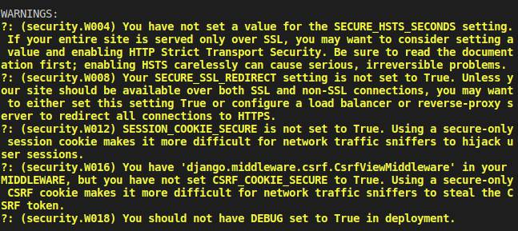

# Deploy checks before deploying App

Run the command `python manage.py check --deploy` at the source root to identify any deployment warnings or errors are present.

> Note: The following errors appear with local development but need
> to be configured during deployment as shown below

### Known errors
The following errors appear when running locally.



To resolve the issues during deployment; set following the environment variables.

```json
  {
    "name": "DJANGO_SECURE_HSTS_PRELOAD",
    "value": "1",
    "slotSetting": false
  },
  {
    "name": "DJANGO_SECURE_HSTS_SECONDS",
    "value": "3600",
    "slotSetting": false
  },
  {
    "name": "DJANGO_SESSION_COOKIE_SECURE",
    "value": "True",
    "slotSetting": false
  },
```
