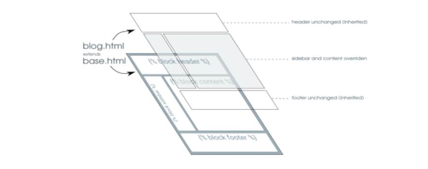
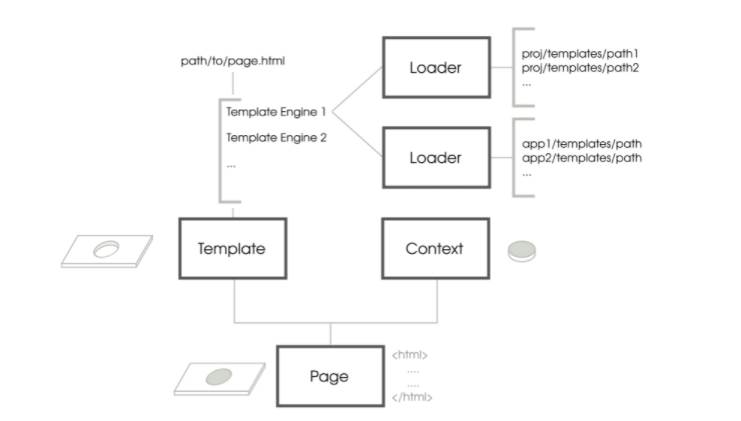

# Usage of templates, Tips and Tricks
Being a web framework, Django needs a convenient way to generate HTML dynamically. The most common approach relies on templates [[1]]([https://link](https://docs.djangoproject.com/en/4.0/topics/templates/))

## Introduction
The django template engine is an agnostic template engine which is not bound on the language used for building templates
 

The template provides the placeholders which are then rendered using the context as shown in the diagram above.

## What makes DjangoTemplateLanguage so great ?

The webpages inside the django application are built with a modular approach.

The recommended approach is to break down the page into multiple blocks(see the base.html in the image below)



## Extensions
It is possible to extend a html template from an app
using the *extends* keyword. The *extends* keyword has to be the first command of the html page.

*basetemplate.html*
```html
AppName/basetemplate.html
<html>
<head>
</head>
<body>


...
..
..
{% endblock}
</body>
</html>
```


*test.html*
```html
test.html



...
..
..
{% endblock}
```
### Key Takeaways
- In the above example, the block content of the *AppName/basetemplate.html* is override by the block content of *test.html*.
- In order to extend the super block, the *test.html* can be edited as follows

    *test.html*
    ```html
    test.html
    
    
    {{ block.super }}
    
    ...
    ..
    ..
    {% endblock}
    ```

- Since the position of the block content is already define in the base file, the position of block content can be moved around in the extended file, but the order

## Django template Specials
- [Template Inclusions](template_inclusions.md)
- [Template Filters](template_filters.md)


